# AWS Highly Available Web Architecture
### Production-Grade 3-Tier Architecture on AWS

[](https://aws.amazon.com/)
[](https://aws.amazon.com/vpc/)
[](https://aws.amazon.com/ec2/)
[](https://aws.amazon.com/rds/)

---

## Overview

This project implements a production-style 3-tier AWS architecture designed for high availability, horizontal scalability, and defence-in-depth network security. No EC2 instance or database is directly reachable from the internet — all traffic flows through controlled layers with strict security group rules enforced at each boundary.

The architecture was stress-tested by manually terminating instances to verify Auto Scaling recovery and validate that the application remained available throughout.

---

## Architecture

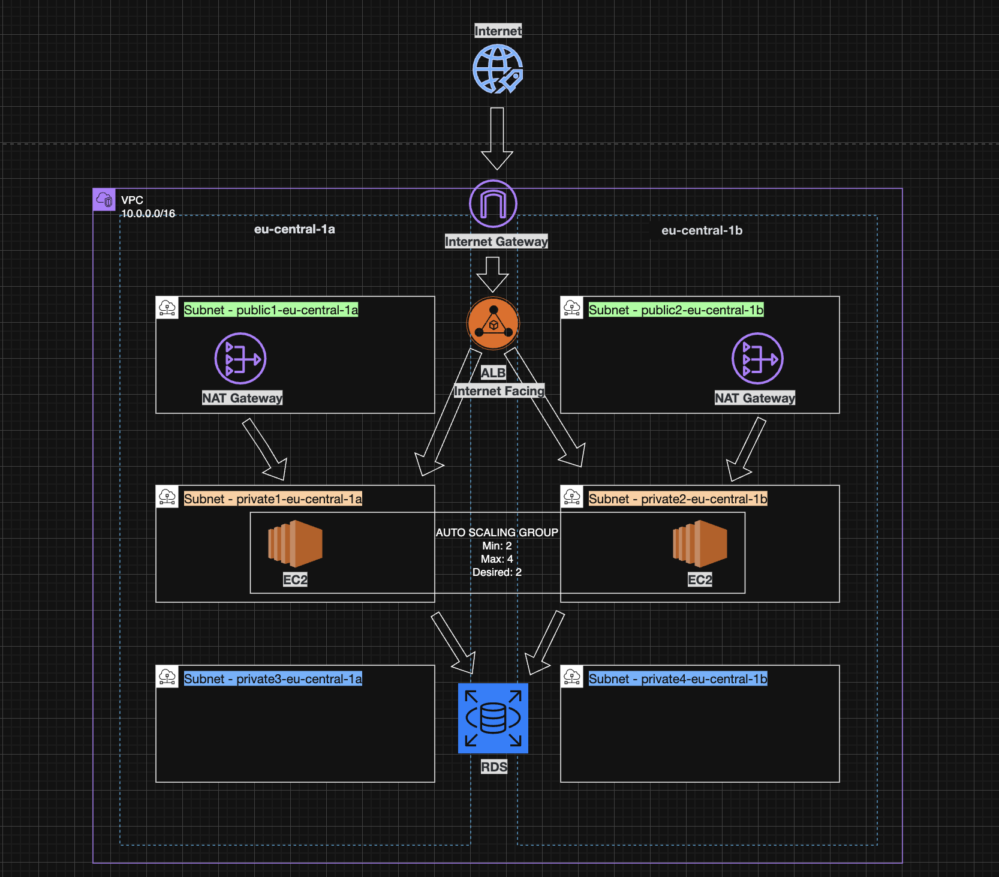

```
Internet
    │
    ▼
Application Load Balancer  (public subnets — AZ-a, AZ-b)
    │
    ▼
Auto Scaling EC2 Fleet     (private app subnets — AZ-a, AZ-b)
    │
    ▼
RDS MySQL (Multi-AZ)       (private DB subnets — AZ-a, AZ-b)
```

---

## Network Layout

```
VPC CIDR: 10.0.0.0/16
│
├── Public Subnets          10.0.1.0/24  · 10.0.2.0/24
│   └── Application Load Balancer, NAT Gateways
│
├── Private App Subnets     10.0.11.0/24 · 10.0.12.0/24
│   └── EC2 Auto Scaling Group (Apache web servers)
│
└── Private DB Subnets      10.0.21.0/24 · 10.0.22.0/24
    └── RDS MySQL instance
```

---

## Security Model

Traffic is restricted to explicit, least-privilege paths at every layer:

| Source | Destination | Allowed |
|---|---|---|
| Internet | Application Load Balancer | HTTP/HTTPS (port 80/443) |
| ALB | EC2 instances | HTTP (port 80) only |
| EC2 instances | RDS MySQL | MySQL (port 3306) only |
| Internet | EC2 / RDS | ❌ No direct access |

EC2 instances have no public IPs and no inbound SSH rules. Management access is handled exclusively through **AWS Systems Manager Session Manager** — no bastion host required.

---

## Services Used

| Service | Role |
|---|---|
| **VPC** | Isolated network with custom CIDR and subnet layout |
| **Internet Gateway** | Enables outbound internet access for public subnets |
| **NAT Gateway** | Allows private subnet instances to reach the internet (e.g. package installs) |
| **Application Load Balancer** | Distributes traffic across EC2 instances across AZs |
| **Target Groups** | Health-checks EC2 instances and routes only to healthy targets |
| **EC2 Launch Templates** | Defines instance config with user data for automated Apache setup |
| **Auto Scaling Group** | Maintains desired capacity, replaces failed instances automatically |
| **RDS MySQL** | Managed relational database in isolated private subnets |
| **IAM Role for EC2** | Grants instances Session Manager access without SSH keys |
| **Session Manager** | Secure, keyless shell access to private EC2 instances |
| **CloudWatch** | Monitors EC2 metrics, ALB health, and Auto Scaling activity |

---

## Auto Scaling Configuration

| Setting | Value |
|---|---|
| Minimum capacity | 2 |
| Desired capacity | 2 |
| Maximum capacity | 4 |
| Health check type | ELB (Application Load Balancer) |

Health checks are performed by the ALB. Instances that fail health checks are automatically deregistered and replaced by the Auto Scaling Group.

---

## Application Layer

Each EC2 instance is bootstrapped via Launch Template user data, which installs Apache and serves a minimal web page displaying the instance ID. This makes it easy to confirm that the ALB is distributing requests across multiple instances.

---

## Database Layer

RDS MySQL is deployed in isolated private DB subnets with no public accessibility. Connectivity was validated end-to-end from an EC2 instance using Session Manager:

- ✅ EC2 → RDS connection established
- ✅ Database created
- ✅ Table created and populated
- ✅ SELECT queries returned expected results

---

## Resilience Test

An EC2 instance was manually terminated via the AWS Console to simulate an availability zone failure.

| Event | Result |
|---|---|
| Instance terminated | Auto Scaling detected unhealthy instance |
| Replacement launched | New instance provisioned and bootstrapped automatically |
| Target group status | Returned to fully healthy within ~2 minutes |
| Application availability | No downtime — ALB continued routing to the surviving instance |

---

## Monitoring

Metrics observed and validated using:

- **CloudWatch EC2 metrics** — CPU utilisation, status checks
- **ALB health checks** — target registration and health state
- **Auto Scaling activity log** — launch and termination events

---

## Screenshots

### 1. VPC Resource Map
*Full VPC layout showing subnets, route tables, internet gateway, and NAT gateways across two AZs.*

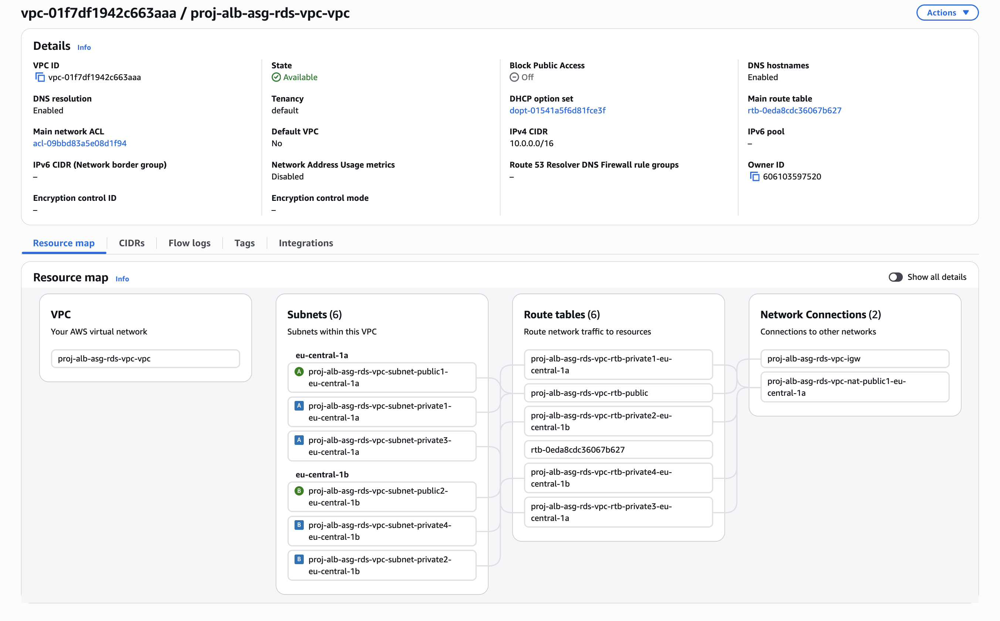

---

### 2. Application Load Balancer
*ALB active and internet-facing, provisioned across both public subnets.*

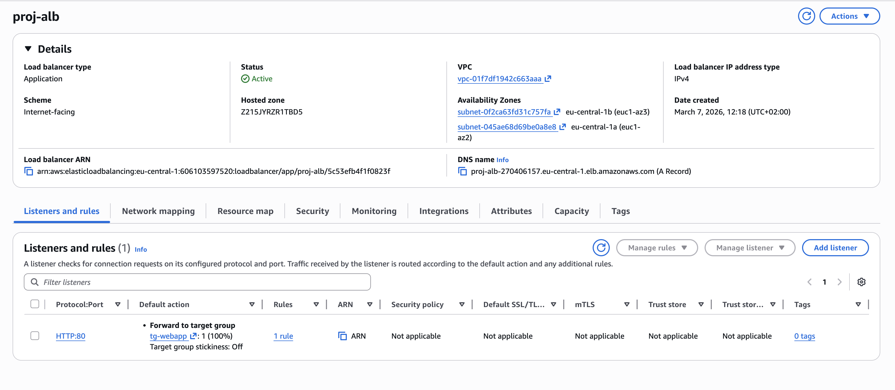

---

### 3. Target Group Health
*Both EC2 instances registered and passing ALB health checks.*

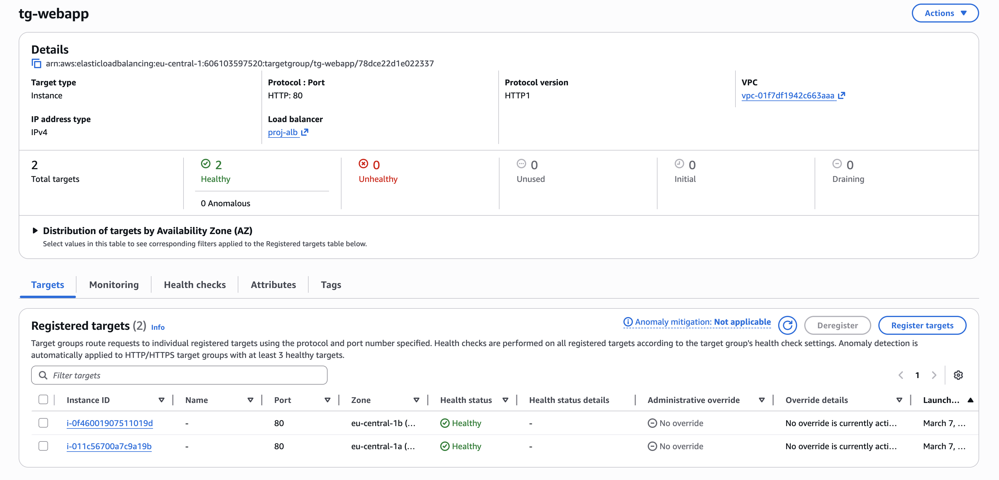

---

### 4. Auto Scaling Group
*ASG configured with min/desired/max capacity and ELB health check type.*

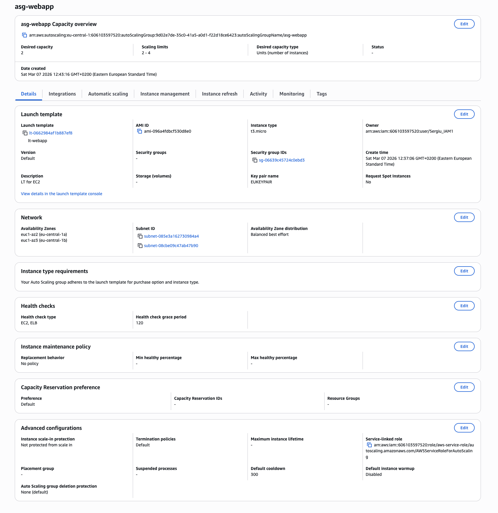

---

### 5. Launch Template
*Launch template defining AMI, instance type, IAM role, and user data bootstrap script.*

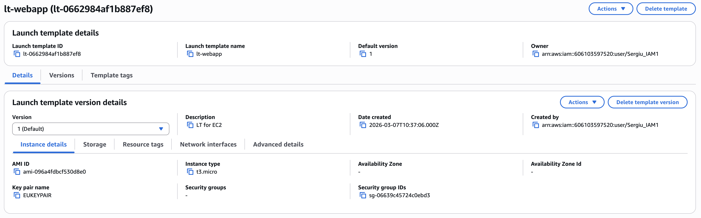

---

### 6. Web Application Through Load Balancer
*Apache web page served via the ALB DNS, displaying the responding EC2 instance ID.*

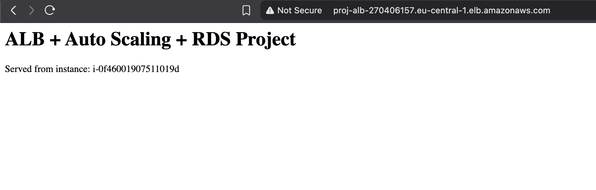

---

### 7. RDS MySQL Instance
*RDS instance running in private DB subnets — no public accessibility enabled.*

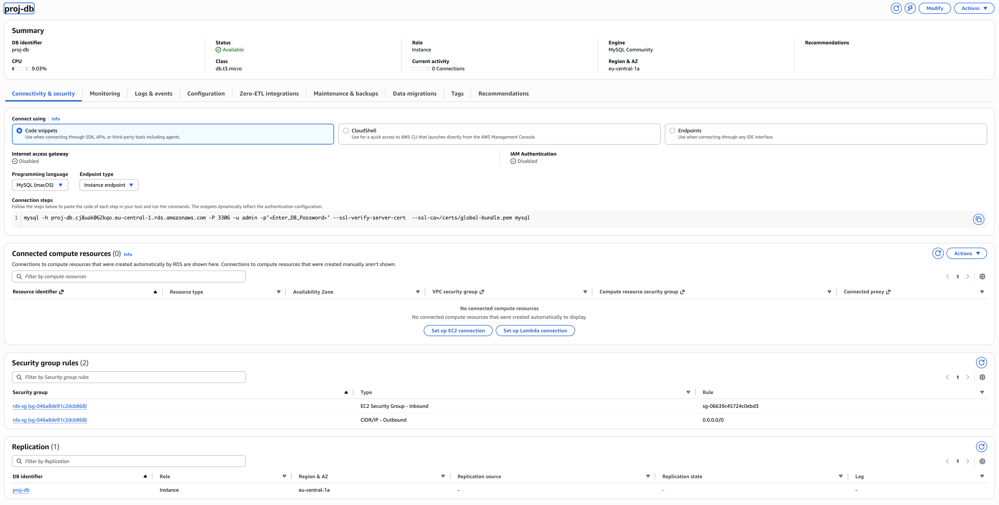

---

### 8. EC2 to RDS MySQL Connection
*Successful connection from EC2 to RDS via Session Manager — no SSH or bastion required.*

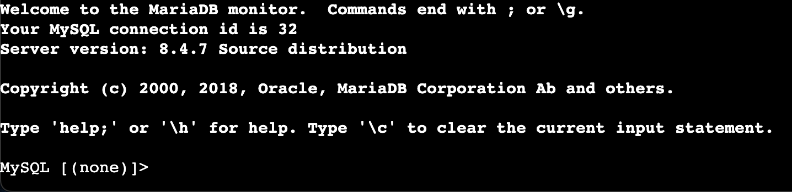

---

### 9. Database Created
*Database and table created inside RDS via the EC2 MySQL client.*

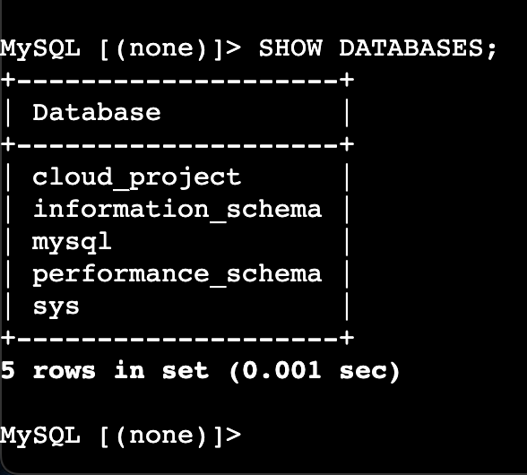

---

### 10. Query Results
*INSERT and SELECT queries executed successfully — confirming end-to-end database connectivity.*

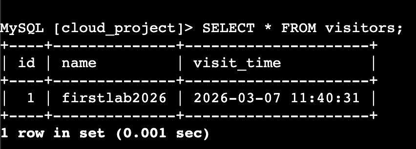

---

## Troubleshooting

### 1. EC2 Instances Passing Auto Scaling Health Checks but Failing ALB Target Group

After deploying the stack, the Auto Scaling Group reported all instances as healthy — but the ALB target group showed them as `unhealthy`, and the load balancer DNS returned a `502`. The instances were running and reachable via Session Manager, and Apache was installed.

The root cause was a security group misconfiguration. The EC2 security group was configured to allow inbound HTTP traffic from `0.0.0.0/0` (the internet) rather than from the ALB security group specifically. While this sounds like it should still work, the ALB health check probes were being blocked because the rule evaluation order combined with a conflicting deny meant traffic from the ALB's internal IPs wasn't matching the expected rule.

**Fix:** Updated the EC2 security group inbound rule to reference the **ALB security group ID** as the source, rather than a CIDR range. This is the correct pattern for ALB-to-EC2 communication — it ensures only the ALB can reach the instances regardless of IP, and it eliminates any ambiguity in rule matching.

**Lesson:** Never use `0.0.0.0/0` as the source for EC2 instances sitting behind an ALB. Always use the ALB's security group ID as the source. It's more secure, more explicit, and avoids exactly this class of subtle connectivity issue.

---

### 2. RDS Connection Timing Out from EC2 Despite Correct Credentials

After establishing a Session Manager session on an EC2 instance, the MySQL connection command hung indefinitely and eventually timed out — even though the RDS endpoint, username, and password were all correct, and the RDS instance showed as `Available` in the console.

The issue was that the RDS security group was missing an inbound rule entirely. The assumption was that placing both EC2 and RDS in the same VPC would allow them to communicate by default — but VPC security groups are deny-by-default. Without an explicit inbound rule on the RDS security group allowing TCP port 3306 from the EC2 security group, all connection attempts were silently dropped at the network level.

**Fix:** Added an inbound rule to the RDS security group: `Type: MySQL/Aurora`, `Port: 3306`, `Source: EC2 security group ID`. The connection succeeded immediately after the rule propagated.

**Lesson:** Being in the same VPC is not the same as being allowed to communicate. Every security group boundary requires an explicit rule in both directions where needed. Always verify security group rules at both ends of a connection — not just the source side.

---

## What I Learned

This was a complex project I've built on AWS, and the one that closely mirrors real production infrastructure. Several things fundamentally changed how I think about cloud architecture:

**High availability has to be designed in from the start — it can't be bolted on.** Spreading subnets, instances, and databases across multiple availability zones isn't just a checkbox — it requires deliberate decisions about CIDR ranges, routing, and load balancer configuration that touch every layer of the stack. Trying to retrofit HA into a single-AZ design would mean rebuilding most of it.

**Security groups are a architecture decision, not a configuration detail.** I came into this thinking of security groups as firewall rules. I left thinking of them as the connective tissue of the entire network — the way you reference one security group as the source in another is what creates clean, maintainable trust boundaries between layers. Using CIDR ranges instead breaks that model and introduces subtle bugs like the ALB health check issue above.

**Session Manager changes how you think about access.** Eliminating SSH entirely — no key pairs, no bastion hosts, no open port 22 — and replacing it with IAM-controlled Session Manager sessions is a significant security posture improvement. It also simplifies the network design considerably. This is how I'll approach EC2 access on every future project.

**Observability is what separates a working system from a trustworthy one.** The resilience test only meant something because I could watch it in CloudWatch — see the instance terminate, the ASG activity log fire, the new instance register, and the target group return to healthy. Without that visibility, I'd have no way to know the system behaved as designed under failure. Monitoring isn't optional in production architecture.

---

## Author

**Sergiu Gota**
AWS Certified Solutions Architect – Associate · AWS Cloud Practitioner

[](https://github.com/sergiugotacloud)
[](https://linkedin.com/in/sergiu-gota-cloud)

> Built as part of a cloud portfolio to demonstrate production-grade AWS architecture, networking, and resilience engineering.
> Feel free to fork, adapt, or reach out with questions.
